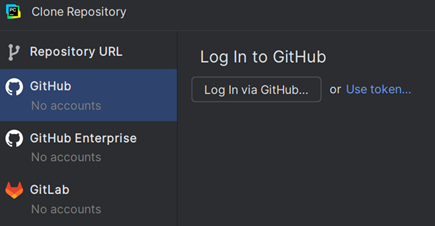
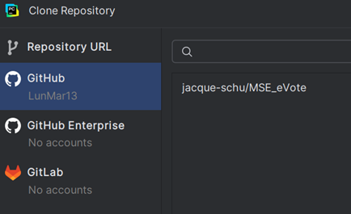
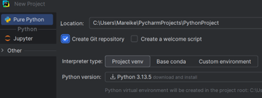
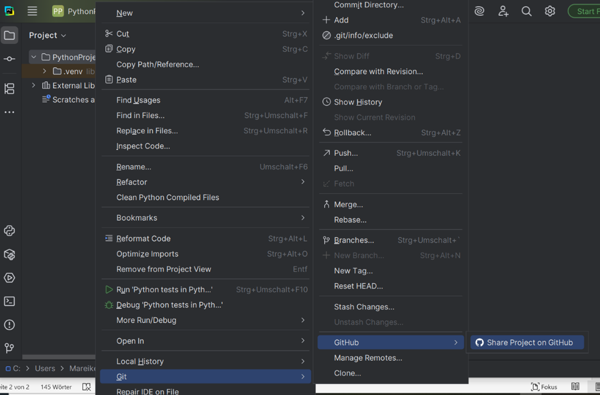
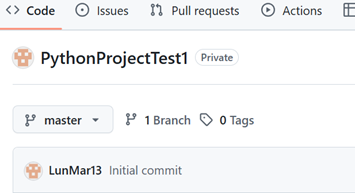

# Übung 1: Erstellen eines Git-Handouts für Anfänger

## 1. Was ist Git und warum sollte es verwendet werden?
### 1.1 Einführung
Git ist ein verteiltes Versionsverwaltungssystem, das ursprünglich von Linus Torvalds (dem Entwickler des Linux-Kernels) im Jahr 2005 entwickelt wurde.
Es dient dazu, Quellcode und andere Dateien effizient zu verwalten, Änderungen nachzuvollziehen und eine strukturierte Zusammenarbeit in Entwicklungsteams zu ermöglichen.

### 1.2 Funktionsweise
Git speichert nicht einfach einzelne Dateiversionen, sondern verfolgt Änderungen im Verlauf eines Projekts.
Jede Änderung („Commit“) wird mit einer eindeutigen ID (Hash) versehen und kann jederzeit nachvollzogen oder rückgängig gemacht werden.
Die Daten werden lokal gespeichert und können mit einem zentralen Server (z. B. GitHub, GitLab oder Bitbucket) synchronisiert werden.

Wichtige Begriffe:
- **Repository (Repo)**: Der Speicherort des Projekts, enthält alle Versionen und Dateien.
- **Branch**: Ein Entwicklungszweig, in dem unabhängig am Code gearbeitet werden kann.
- **Commit**: Eine gespeicherte Änderung am Projektzustand.
- **Merge**: Das Zusammenführen verschiedener Entwicklungszweige.
- **Remote**: Ein Server, mit dem das lokale Repository abgeglichen wird (z. B. GitHub).

### 1.3 Vorteile der Verwendung von Git
**a) Versionskontrolle**

Jede Änderung im Projekt wird dokumentiert. Frühere Versionen können jederzeit wiederhergestellt werden – Fehler oder fehlerhafte Updates lassen sich einfach rückgängig machen.

**b) Zusammenarbeit im Team**

Mehrere Entwickler*innen können gleichzeitig an verschiedenen Teilen eines Projekts arbeiten, ohne sich gegenseitig zu stören. Durch Branches werden parallele Entwicklungen ermöglicht.

**c) Nachvollziehbarkeit und Transparenz**

Git speichert, wer, wann und was geändert hat. Dadurch bleibt die Entwicklungshistorie vollständig nachvollziehbar und überprüfbar.

**d) Sicherheit und Redundanz**

Da jede lokale Kopie eines Git-Repositories eine vollständige Version des Projekts enthält, geht kein Code verloren – selbst wenn der Server ausfällt.

**e) Integration mit Plattformen**

Plattformen wie GitHub, GitLab oder Bitbucket bieten zusätzliche Funktionen wie Pull Requests, Issue Tracking oder Continuous Integration, die die Zusammenarbeit und Qualitätssicherung weiter verbessern.

### 1.4 Fazit
Git ist ein zentrales Werkzeug moderner Softwareentwicklung.
Es ermöglicht strukturierte Teamarbeit, sichert den Entwicklungsverlauf und schafft Transparenz im gesamten Projektlebenszyklus.
Durch seine Effizienz, Zuverlässigkeit und weite Verbreitung ist Git heute der De-facto-Standard für Versionskontrolle in nahezu allen Entwicklungsumgebungen.

## 2.Grundlegende Git-Befehle

- **git init**  
  Initialisiert ein neues Git-Repository im aktuellen Verzeichnis.

- **git clone <URL>**  
  Kopiert ein bestehendes Repository von einem Remote-Server.

- **git add <Datei>**  
  Fügt Änderungen einer Datei dem kommenden Commit hinzu.

- **git commit -m "<Nachricht>"**  
  Speichert die Änderungen im Repository mit einer Nachricht.

- **git status**  
  Zeigt den aktuellen Zustand der Arbeitskopie und der Staging-Area an.

- **git push**  
  Überträgt Commits vom lokalen Repository ins entfernte Repository.

- **git pull**  
  Holt und integriert Änderungen vom entfernten Repository in das lokale.

- **git branch**  
  Listet lokale Branches auf, erstellt oder löscht Branches.

- **git checkout <Branch>**  
  Wechselt zu einem anderen Branch oder stellt Dateien wieder her.

- **git merge <Branch>**  
  Führt Änderungen eines anderen Branches mit dem aktuellen zusammen.

## 3. Branches und ihre Nutzung, Umgang mit Merge-Konflikten

### 3.1 Branches
Branches sind Entwicklungszweige, die parallel in einem Versionskontrollsystem wie Git entwickelt werden.
Ein Branch ermöglicht es, unabhängig vom Haupt-(main/master) Branch neue Features, Bugfixes oder experimentelle Funktionen zu entwickeln, ohne dabei den stabilen Code (main branch) zu beeinflussen.

Eine typische Nutzung sieht oft wie folgt aus:

Main Branch: Dies ist die stabile Produktionsversion.
Feature Branches: Dient zur Entwicklung neuer Features.
Bugfix Branches: Dient zur Behebung von Fehlern, ohne dabei die Hauptentwicklung zu stören.
Release Branches: Dient zur Vorbereitung neuer Releases (Veröffentlichungen).

Branches können nach Fertigstellung wieder in den Hauptbranch gemerged werden.
Mergen bedeutet, dass zwei Branches im Versionskontrollsystem Git miteinander zusammengeführt werden.
Dabei werden die Änderungen, die in einem Branch gemacht werden, in den anderen Branch integriert.

### 3.2 Merge-Konflikte
Merge-Konflikte entstehen, wenn in unterschiedlichen Branches dieselben Codebereiche geändert wurden.
In diesem Fall kann Git nicht automatisch entscheiden, welche Änderungen bleiben.
Ein Merge-Konflikt muss manuell gelöst werden.

Ein typisches Vorgehen bei Merge-Konflikten sieht wie folgt aus:

Git zeigt die Konflikte beim merge an.
Die Konfliktstellen sind dabei im Code markiert.
Die Entwickler müssen entscheiden, welche Änderungen übernommen oder kombiniert werden.
Erst nach der Auflösung des Konflikts wird der Code committet.
Anschließend können Tests dabei helfen, eine korrekte Lösung sicherzustellen.

## 4. Git mit PyCharm benutzen

### 4.1 PyCharm mit GitHub verbinden

Nach dem Login via GitHub sind auf der linken Seite der Accountname und auf der rechten Seite die zugehörigen Repositories sichtbar.

### 4.2 Ein Git-Repository über PyCharm initialisieren

Beim Erstellen eines neuen Projekts in PyCharm kann ein Git-Repository mit erstellt werden.

In diesem Fall wird lokal ein .git Ordner erstellt.
Dieser Ordner enthält alle Informationen, die Git braucht, um ein Projekt zu verwalten:
- **Den Versionsverlauf** (Commits, Branches, Tags)
- **Die Konfiguration** (z. B. Name, Remote-URLs)
- **Den Index** (Staging Area)
- **Die Objekte** (Dateien in komprimierter Form)

### 4.3 Arbeiten in einem lokalen Repository

Das lokale Repository befindet sich auf dem eigenen Rechner. Hier können Änderungen vorgenommen werden, ohne dass jemand anderes darauf Zugriff hat.

### 4.4 Arbeiten in einem remote Repository

Ein remote Repository liegt auf einem anderen Server (z.B. bei GitHub) und dient z.B. der Zusammenarbeit an einem Projekt.

### 4.5 Das PyCharm-Projekt mit GitHub verbinden

Nachdem das Projekt mit GitHub geteilt wurde, kann es dort z.B. für eine Zusammenarbeit veröffentlicht werden.

## 5. Nützliche Git-Tools und Plattformen

### 5.1 GitHub

**GitHub** ist eine bekannte Plattform zur Verwaltung von Git-Repositories in der Cloud.
Sie bietet nicht nur Speicherplatz für Code, sondern auch viele Funktionen zur Teamarbeit und Projektorganisation.

#### Hauptfunktionen
- **Remote-Repositories:** Speicherung des Codes in der Cloud, um von überall darauf zugreifen zu können.  
- **Pull Requests:** Entwickler können Änderungen vorschlagen, die dann von anderen überprüft („reviewed“) und freigegeben werden.  
- **Code Review:** Kommentare und Diskussionen direkt an Codezeilen möglich – ideal zur Qualitätssicherung.  
- **Issues & Projektverwaltung:** Aufgaben, Bugs und Ideen können als „Issues“ erfasst, kommentiert und priorisiert werden.  
- **GitHub Actions:** Automatisierung von Prozessen wie Tests, Builds oder Deployments (CI/CD).  
- **Wikis & Pages:** Möglichkeit, Dokumentationen oder Websites direkt im Repository zu pflegen.

#### Vorteile
- Weltweit verbreitet
- Gute Integration in IDEs wie PyCharm, IntelliJ und VS Code  
- Kostenlos für öffentliche und private Projekte  
- Ideal für Open-Source- und Teamprojekte

### 5.2 GitLab

**GitLab** ist eine leistungsfähige Alternative zu GitHub und besonders beliebt in Unternehmen,
die eigene Server betreiben möchten.

#### Hauptfunktionen
- Git-Repository-Verwaltung mit Rechten und Rollen
- **Self-Hosting** möglich → Daten bleiben im eigenen Netzwerk  
- **Wiki, Issue Tracker und Boards** ähnlich wie GitHub  
- **Merge Requests** statt Pull Requests (gleiche Idee)

#### Vorteile
- Datenschutzfreundlich, da lokal installierbar  
- Umfassende Automatisierungs- und Sicherheitsfunktionen
- Ideal für Unternehmen mit strengen Compliance-Richtlinien

###  5.3 Grafische Git-Tools

Neben den Online-Plattformen gibt es Desktop-Anwendungen, die Git-Befehle visuell darstellen und besonders für Einsteiger hilfreich sind.

#### Sourcetree
- Kostenloses Git-Tool von Atlassian  
- Zeigt Commits, Branches und Merges als übersichtlichen Verlauf (Commit-Graph)  
- Ideal, um ohne Terminal zu arbeiten  
- Unterstützt GitHub, GitLab und Bitbucket  

#### GitKraken
- Moderne, optisch ansprechende Benutzeroberfläche  
- Visualisierung von Branches, Commits und Merges  
- Integrierter Code-Editor und GitHub-/GitLab-/Bitbucket-Anbindung  
- Besonders beliebt bei Teams, die visuell arbeiten möchten

#### GitHub Desktop
- Offizielles GUI-Tool von GitHub.  
- Einfaches Klonen, Committen, Branch-Wechseln und Pushen ohne Terminal.  
- Integration mit GitHub.com für Pull Requests und Issues.

## Dokumentation der Zusammenarbeit ##
- Was ist Git und warum sollte es verwendet werden? : Jacqueline Schulz
- Grundlegende Git-Befehle (z. B. git init, git add, git commit, git push): Heike Fritz
- Branches und ihre Nutzung, Umgang mit Merge-Konflikten: Fabian Meintzer
- Git mit IntelliJ/PyCharm benutzen: Local Repository und Remote Repository: Mareike Starker
- Nützliche Git-Tools und Pla ormen (z. B. GitHub): Fabian Scholl

# Übung 2: Einrichtung einer CI/CD-Pipeline
## 1. Einrichtung und Fehlerbehebung eines GitHub Actions Workflows für Python 
Die Dokumentation beschreibt die schrittweise Einrichtung und Optimierung eines GitHub-Actions-Workflows für ein Python-Projekt, der den Code bei jedem Commit automatisch prüft und testet und dabei typische Fehler sowie deren Lösungen behandelt.

### 1.1 Ziel des Workflows 
Der Workflow sorgt dafür, dass bei Änderungen am main-Branch (Hauptzweig) der Python-Code automatisch mit GitHub Actions überprüft wird, wobei eine YAML-Datei Schritte wie Abhängigkeitsinstallation, Linting mit flake8 und Tests mit pytest definiert.

### 1.2 Aufbau der Datei python-app.yml 
Die Datei 'python-app.yml' wurde im Verzeichnis '.github/workflows' angelegt. Sie enthält 
Anweisungen für GitHub, wie der Code automatisch überprüft werden soll. Der Workflow 
führt folgende Aufgaben aus: 

- Den Code aus dem Repository auschecken 
- Python 3.10 einrichten 
- Abhängigkeiten installieren (z. B. flake8, pytest) 
- Den Code mit flake8 auf Fehler prüfen 
- Alle Tests mit pytest ausführen

### 1.3 Aufgetretene Fehler und Ursachen
Während der Entwicklung des Workflows traten mehrere Fehler auf, die typisch für YAML- 
und CI/CD-Setups sind: 

**Syntaxfehler in der YAML-Datei:** 

YAML-Dateien sind sehr empfindlich bei Einrückungen. Ein Kommentar in der Zeile unter 'run: |' war nicht richtig eingerückt und führte dazu, dass der Workflow nicht ausgeführt werden konnte. Nach der Korrektur der 
Einrückung funktionierte der Workflow wieder. 

**Fehlende requirements.txt:**

GitHub Actions zeigte die Warnung 'No file matched to requirements.txt', da keine Abhängigkeitsdatei im Projekt gefunden wurde. Der Workflow wurde angepasst, um auch ohne diese Datei weiterlaufen zu können. 

**Exit Code 5 (pytest):**  

Der Workflow schlug mit dem Code 5 fehl, weil pytest keine Testdateien im Projekt fand. Das wurde behoben, indem eine einfache Testdatei ('test_sanity.py') hinzugefügt wurde oder der Workflow so angepasst wurde, dass er auch 
ohne Tests erfolgreich abgeschlossen wird. 

### 1.4 Branches und Commits 

Während der Fehlerbehebung wurden mehrere Commits auf einem eigenen Branch mit dem Namen 'fabtomsch' erstellt. Dieser Branch wurde verwendet, um Änderungen am Workflow zu testen, ohne den Hauptzweig zu beeinflussen. Nachdem die Datei korrekt funktionierte, konnte sie anschließend in den main-Branch übernommen werden. So bleibt der Hauptzweig stets stabil und funktionsfähig.

### 1.5 Ergebnis und Erkenntnisse 

Am Ende lief der Workflow erfolgreich durch. Der Code wird nun automatisch geprüft, wenn Änderungen am main-Branch vorgenommen werden. Dabei werden sowohl die Codequalität (Linting) als auch die Tests überprüft. Durch die iterative Fehlerbehebung wurde deutlich, wie wichtig korrekte YAML-Syntax, Testdateien und klare Branch-Strukturen sind. 

### 1.6 Fazit 
Der Aufbau dieses Workflows zeigt, wie man mit GitHub Actions eine einfache, aber effektive Continuous-Integration-Pipeline für Python-Projekte einrichtet. Auch wenn anfangs kleinere Fehler auftraten, führten sie zu einem besseren Verständnis für YAML-Strukturen, Testkonventionen und Versionskontrolle mit Git.

# Übung 3: Systemarchitektur des Projektes modellieren 

**Übersicht der:**
- Entitäten, Aggregate & Werte
- Bounded Contexts (BC)
- Domain Services und Repositories

### Entitäten und Aggregates

**Bürgerverwaltung (Aggregate Root)**
- Entität: Bürger

- Aggregate: Bürger (enthält alle Daten des Bürgers zur Registrierung, Aktivierung, E-Mail-Bestätigung, Statuswechsel)
- Attribute: Bürger-ID, Name, E-Mail, Passwort(-Hash), Status (aktiv/gesperrt), Datum der Registrierung, E-Mail-Bestätigung (als Value Object), Adressdaten

- Methoden: registrieren(), aktivieren(), sperren(), bestätigung_versenden(), bestätigung_validieren()

**Abstimmungsmanagement (Aggregate Root)**
- Entität: Abstimmung

- Aggregate: Abstimmung (enthält alle Daten zu einer Abstimmung, inkl. Frist und Status)
- Attribute: Abstimmungs-ID, Titel, Beschreibung, Frist (Value Object: Start-/Enddatum), Status (offen/geschlossen/archiviert)

- Methoden: abstimmung_erstellen(), abstimmung_schließen(), frist_prüfen(), beschreibung_aktualisieren()

**(Teilnahme) / Stimme (Aggregate Root)**
- Entität: Stimme

- Aggregate: Stimme (fasst die Stimmabgabe eines Bürgers für eine Abstimmung zusammen)
- Attribute: Stimmen-ID, Bürger-ID (Referenz), Abstimmungs-ID (Referenz), Auswahl/Option, Zeitstempel

- Methoden: abgeben(), ändern(), widerrufen()


**Abstimmungsübersicht / Abstimmungsübersicht / Ergebnis-Aggregat (Aggregate Root)**
- Entität: Abstimmungsübersicht

- Aggregate: Abstimmungsübersicht (bzw. Ergebnis)
- Attribute: Liste der aktuellen Abstimmungen (Titel, Beschreibung, Frist, Status), ggf. Ergebnisse pro Abstimmung (Anzahl Stimmen je Option)

- Methoden: abstimmungsuebersicht_anzeigen(), ergebnis_berechnen(), filtern(), sortieren()

